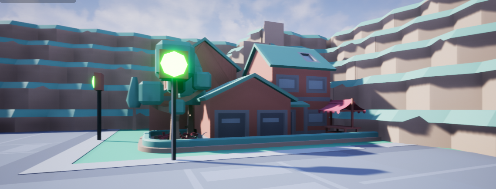
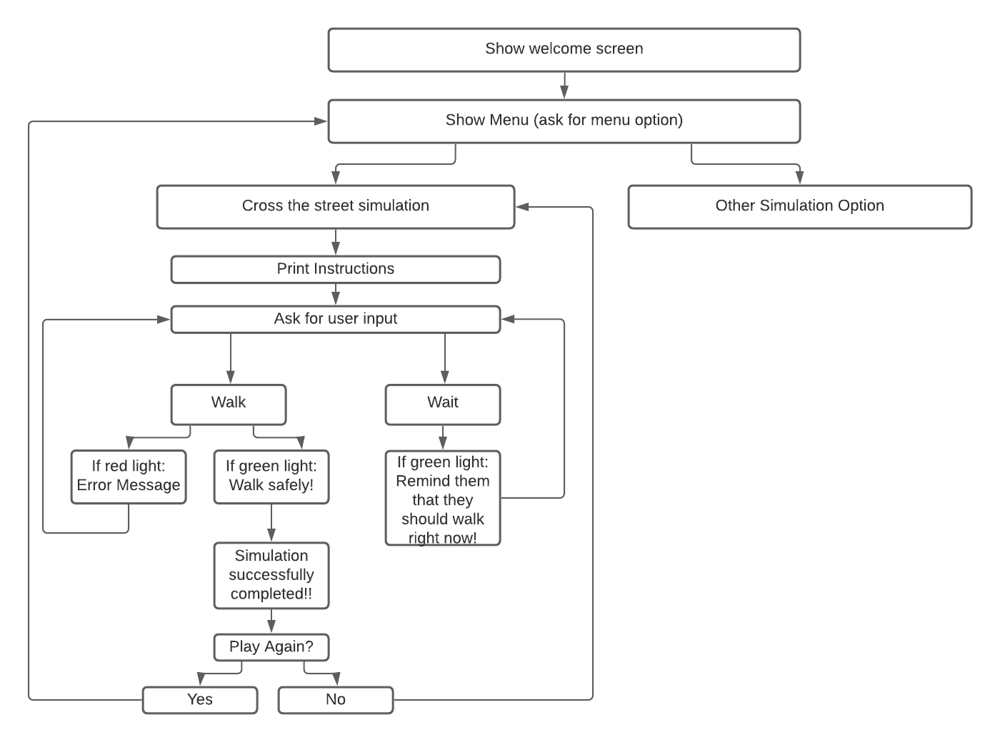

# Pedestrian Safety Simulation for Autistic Children
## CSC 211H Spring 2021  Honours Project
## [Project Website](https://sites.google.com/view/csc211hsharna/home "Website") | [Video Demo](https://youtu.be/LqL8Kih2aLM "Video Demo")

### The Problem
The problem that I am addressing in this project is the lack of accessible and affordable resources available to enrich the learning of autistic children. In the United States, parents can expect to pay upwards of $90,000 annually to provide their autistic children with the necessary programs to service them. The amount of products that are accessible to autistic children outside of these programs are scarce and equally expensive, leaving parents with very limited options.
### The Solution
One solution is to create an online  learning platform for autistic children that is accessible from a range of devices, such as desktop, mobile, and Virtual Reality. The platform would include modules that teach essential life skills to austistic children. The modules would be sensitive to the needs of an austistic child. For example, it will not include win or lose functionalities. Every part of the app would be in the favor and betterment of the child using it.
### Technologies & Resources Used
- Unreal Engine
- C++
- Visual Studio Code
- [Kenney.nl](https://kenney.nl/)

### Algorithm

### UML

### Challenges
- The biggest challenge I faced with this project was learning Unreal Engine for the first time. Unreal Engine is a complex and powerful game engine that requires a learning curve for new developers, and it was a daunting but rewarding experience to learn how to develop applications with Unreal. 
- My second biggest challenge was integrating this application to be accessible with a Virtual Reality headset without incurring virtual reality motion sickness. Virtual Reality motion sickness is when a user feels unwell because their eyes are manipulated to believe that they are moving, but their other four senses understand that they are not moving. My solution to this challenge was to make the application accessible via desktop, as it was originally meant to solely be a VR application.

### Future Direction
- My future direction for this project is to add more modules, such as creating a simulation to cook a simple meal, calm down from anxiety, and recognize emergency situations. 
- I would like to also add more functionalities to each module, such as showing the user positive reinforcement through the simulations, and giving them an option to review the instructions at any time.
